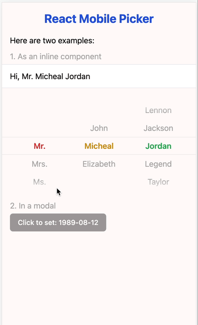

# React Mobile Picker


[](https://www.npmjs.org/package/react-mobile-picker)


React Mobile Picker is a super simple component like iOS picker for React. It's almost unstyled, so you can easily customize it as you like.

<kbd></kbd>

## Preview


Scan this Qr in you mobile.

Or visit (in mobile or mobile simulator): [https://react-mobile-picker.vercel.app](https://react-mobile-picker.vercel.app)

## Installation

```bash
npm install react-mobile-picker
```
or
```bash
yarn add react-mobile-picker
```

## Basic usage

By design, React Mobile Picker is a [controlled component](https://react.dev/learn/sharing-state-between-components#controlled-and-uncontrolled-components), which means the selected items of the rendered element will always reflect the `value` prop. Every time you want to change the selected items, just modify the `value` prop.

```jsx
import { useState } from 'react'
import Picker from 'react-mobile-picker'

const selections = {
  title: ['Mr.', 'Mrs.', 'Ms.', 'Dr.'],
  firstName: ['John', 'Micheal', 'Elizabeth'],
  lastName: ['Lennon', 'Jackson', 'Jordan', 'Legend', 'Taylor']
}

function MyPicker() {
  const [pickerValue, setPickerValue] = useState({
    title: 'Mr.',
    firstName: 'Micheal',
    lastName: 'Jordan'
  })

  return (
    <Picker value={pickerValue} onChange={setPickerValue}>
      {Object.keys(selections).map(name => (
        <Picker.Column key={name} name={name}>
          {selections[name].map(option => (
            <Picker.Item key={option} value={option}>
              {option}
            </Picker.Item>
          ))}
        </Picker.Column>
      ))}
    </Picker>
  )
}
```

## Using render props

Each `Picker.Item` component exposes a `selected` state that can be used to customize the appearance of the item. This is called the [render props](https://legacy.reactjs.org/docs/render-props.html) technique.

```jsx
import { useState } from 'react'
import { Picker } from 'react-mobile-picker'

function MyPicker() {
  const [pickerValue, setPickerValue] = useState({
    name1: 'item1',
    /* ... */
  })

  return (
    <Picker value={pickerValue} onChange={setPickerValue}>
      <Picker.Column name="name1">
        <Picker.Item value="item1">
          {({ selected }) => (
            /* Use the `selected` state ti conditionally style the selected item */
            <div style={{ color: selected ? 'red' : 'black' }}>
              Item 1
            </div>
          )}
        </Picker.Item>
        {/* ... */}
      </Picker.Column>
      {/* ... */}
    </Picker>
  )
}
```

## Support wheel scrolling

React Mobile Picker is designed to be used on mobile devices, but it can also support wheel scrolling on desktop browsers. To enable this feature, you can set the `wheel` prop to either `'natural'` or `'normal'`.

```jsx
import { useState } from 'react'
import { Picker } from 'react-mobile-picker'

function MyPicker() {
  const [pickerValue, setPickerValue] = useState({
    name1: 'item1',
    /* ... */
  })

  return (
    <Picker value={pickerValue} onChange={setPickerValue} wheel="natural">
      {/* ... */}
    </Picker>
  )
}
```

## Component API

### Picker

the main Picker container component.

| Prop | Default | Description |
| :---- | :------- | :----------- |
| value | N/A | `{ [name: string]: string }`<br />Selected value pairs |
| onChange | N/A | `(value: T, key: string) => void`<br />Callback function when the selected value changes |
| height | 216 | `number`<br />Height of the picker in `px` |
| itemHeight | 36 | `number`<br />Height of each item (that is each option) in `px` |
| wheel | `'off'` | `'off' \| 'natural' \| 'normal'`<br />Enable wheel scrolling on desktop browsers |

### Picker.Column

The wrapper component for each column.

| Prop | Default | Description |
| :---- | :------- | :----------- |
| name | N/A | `string`<br />The name should be one of the keys of the `value` in `Picker` component |

### Picker.Item

The wrapper component for each selectable option.

| Prop | Default | Description |
| :---- | :------- | :----------- |
| value | N/A | `string`<br />The value of the current option |

| Render Prop | Description |
| :----------- | :----------- |
| selected | `boolean`<br />Whether or not the current option is selected |

## More examples

You can check out the [examples](./examples) folder for more code samples. Or run this project locally:

```bash
git clone this repo
cd react-mobile-picker
pnpm i
pnpm run dev
point your browser to http://localhost:5173
```

## License

MIT.
